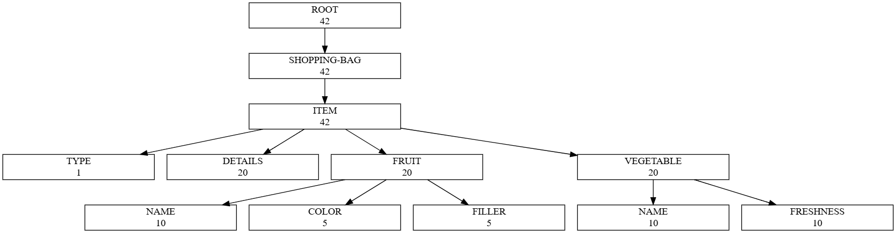

# POSIMAP

*POSIMAP* is a blend of "POSItional MAPper".

This tool can transform fixed-width positional files into JSON and convert them back.

## Features

- Parse fixed-width text files based on a declarative positional schema.
- Convert structured data back into fixed-width text files.
- Easy configuration via YAML.
- Minimal dependencies, fast and lightweight.
- Supports validation and field trimming (optional).
- Supports text encoding conversion (EBCDIC, Unicode, ...).
- Supports OCCURS and REDEFINES in schema definition.
- Supports packed decimal encoding (COMP-3).

## Why POSIMAP ?

Fixed-width files are still widely used in legacy systems, financial data exchanges, and large-scale batch processing. POSIMAP helps bridge the gap between fixed-width formats and structured modern data workflows.

## Usage

### Example fixed-width data file (`person.fixed-width`)

```text
JOHN    DOE     1234 ELM STREET          SPRINGFIELD, IL 62704
JANE    SMITH   56 MAPLE AVENUE          RIVERSIDE, CA 92501
```

This file contains fixed-length records laid out according to the following schema.

| FIRSTNAME | LASTNAME | ADDRESS LINE-1 | ADDRESS LINE-2 | LINE FEED |
| --------- | -------- | -------------- | -------------- | --------- |
| 8 bytes   | 8 bytes  | 25 bytes       | 25 bytes       | 1 byte    |

### Example config (`schema.yaml`)

We can create a configuration file that maps the record into a nested object structure.

```yaml
length: 67 # total length of one record
schema:
  - name: FIRSTNAME
    length: 8
  - name: LASTNAME
    length: 8
  - name: ADDRESS
    schema:
      - name: LINE-1
        length: 25
      - name: LINE-2
        length: 25
  - name: NL # contains the new line separator from the input file
    length: 1
```

### Transform from fixed-width file to JSON format

Using the `fold` command with the configuration file, the input file's content can be transformed into a JSON Lines (JSONL) structure, where each line is a JSON document representing a record from the input file.

```console
$ posimap fold < person.fixed-width
{"FIRSTNAME":"JOHN","LASTNAME":"DOE","ADDRESS":{"LINE-1":"1234 ELM STREET","LINE-2":"SPRINGFIELD, IL 62704"}}
{"FIRSTNAME":"JANE","LASTNAME":"SMITH","ADDRESS":{"LINE-1":"56 MAPLE AVENUE","LINE-2":"RIVERSIDE, CA 92501"}}
```

### Transform from JSON file to fixed-width format

From a JSON Lines document, we can also use the `unfold` command with the same configuration file to generate a fixed-width file containing the corresponding records.

```console
$ posimap unfold < person.json
JOHN    DOE     1234 ELM STREET          SPRINGFIELD, IL 62704
JANE    SMITH   56 MAPLE AVENUE          RIVERSIDE, CA 92501
```

## Advanced configuration

Here is another schema configuration containing OCCURS and REDEFINES.

```yaml
length: 42
schema:
  - name: SHOPPING-BAG
    schema:
      - name: ITEM
        occurs: 2 # This field repeats 2 times
        schema:
          - name: TYPE # 'F' for fruit, 'V' for vegetable
            length: 1
          - name: DETAILS
            length: 20
          - name: FRUIT
            redefine: DETAILS
            when: '{{ index . "TYPE" | eq "F" }}'
            schema:
              - name: NAME
                length: 10
              - name: COLOR
                length: 5
          - name: VEGETABLE
            redefine: DETAILS
            when: '{{ index . "TYPE" | eq "V" }}'
            schema:
              - name: NAME
                length: 10
              - name: FRESHNESS
                length: 10
```

Posimap will be able to marshal records from fixed-width files into this data structure



Important points to note :

- The `DETAILS`, `FRUIT`, and `VEGETABLE` fields share the same underlying data in the record, thanks to the `redefine` option in the configuration file.
- The `ITEM` field spans a total length of 42 bytes, as it is repeated twice due to the `occurs` option in the configuration file.
- The `FRUIT` field includes a `FILLER` of 5 bytes, automatically detected by Posimap to ensure all redefined fields maintain the same total length.

### Using separators

If your input file uses separators between each record, you can specify the `separator` option in the root section of your configuration file instead of using `length`.

```yaml
separator: "\n"
schema:
  ...
```

### Nested configuration

Sub-schema can refer to an external configuration file.

```yaml
schema:
  - name: FIRSTNAME
    length: 8
  - name: LASTNAME
    length: 8
  - name: ADDRESS               # configured in an external schema file
    schema: schema-address.yaml # path is relative to this file
```

### Use different charsets

By default, Posimap uses the ISO8859_1 character set, but this can be customized using the `--charset` flag.

```console
posimap fold -c IBM_037 < person.fixed-width
```

Supported charsets are listed under the `charsets` command.

```console
$ posimap charsets
CHARSET NAME        DESCRIPTION
------------------- ---------------------------------------
IBM_037             IBM Code Page 037
...
```

### Disable trimming

```console
$ posimap fold --notrim < person.fixed-width
{"FIRSTNAME":"JOHN    ","LASTNAME":"DOE     ","ADDRESS":{"LINE-1":"1234 ELM STREET          ","LINE-2":"SPRINGFIELD, IL 62704    "}}
```

### Packed decimal (COMP-3)

POSIMAP supports packed decimal (COMP-3) encoding, commonly used in mainframe systems. When working with packed decimal fields, you need to:

1. Specify the `codec: COMP-3` attribute
2. Define the `picture` clause that describes the field format

Example configuration:

```yaml
  - name: AMOUNT
    codec: COMP-3
    picture: S9(5)V99  # Signed, 5 digits before decimal point, 2 after
```

The `picture` format follows standard COBOL notation:

- `S` indicates the value is signed
- `9(n)` represents n numeric digits
- `V` represents an implied decimal point (no actual character in the data)

Packed decimal fields typically use half the bytes of their displayed value, plus half a byte for the sign.

## Contributing

Pull requests are welcome. For major changes, please open an issue first to discuss what you would like to change.

## License

Copyright (C) 2025 CGI France

Posimap is free software: you can redistribute it and/or modify it under the terms of the GNU General Public License as published by the Free Software Foundation, either version 3 of the License, or (at your option) any later version.

Posimap is distributed in the hope that it will be useful, but WITHOUT ANY WARRANTY; without even the implied warranty of MERCHANTABILITY or FITNESS FOR A PARTICULAR PURPOSE. See the GNU General Public License for more details.

You should have received a copy of the GNU General Public License along with posimap. If not, see http://www.gnu.org/licenses/.
